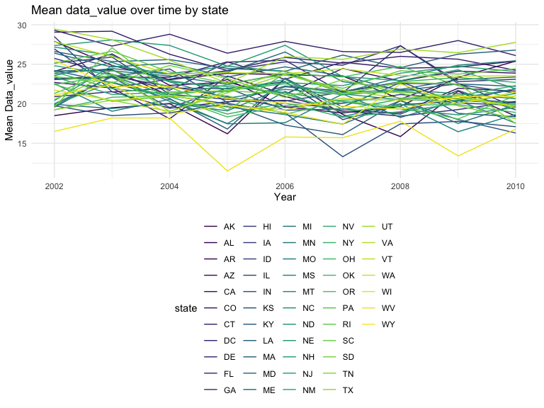
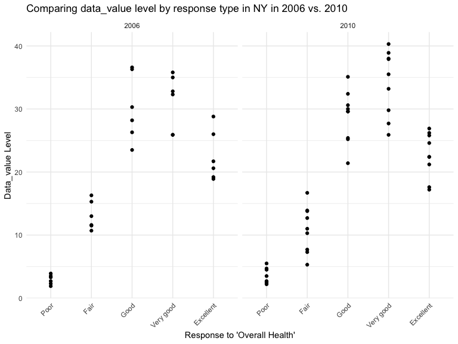

p8105_hw3_crd2162
================
Caleigh Dwyer
2023-10-11

\##Problem 1: Instacart

``` r
data("instacart")
instacart = 
  instacart |> 
  as_tibble()
```

This dataset contains 1384617 rows and 15 columns, with each row
representing a single product from an instacart order. Variables include
identifiers for user, order, and product; the order in which each
product was added to the cart. There are several order-level variables,
describing the day and time of the order, and number of days since prior
order. Then there are several item-specific variables, describing the
product name (e.g. Yogurt, Avocado), department (e.g. dairy and eggs,
produce), and aisle (e.g. yogurt, fresh fruits), and whether the item
has been ordered by this user in the past. In total, there are 39123
products found in 131209 orders from 131209 distinct users.

Below is a table summarizing the number of items ordered from aisle. In
total, there are 134 aisles, with fresh vegetables and fresh fruits
holding the most items ordered by far.

``` r
instacart |> 
  count(aisle) |> 
  arrange(desc(n))
```

    ## # A tibble: 134 × 2
    ##    aisle                              n
    ##    <chr>                          <int>
    ##  1 fresh vegetables              150609
    ##  2 fresh fruits                  150473
    ##  3 packaged vegetables fruits     78493
    ##  4 yogurt                         55240
    ##  5 packaged cheese                41699
    ##  6 water seltzer sparkling water  36617
    ##  7 milk                           32644
    ##  8 chips pretzels                 31269
    ##  9 soy lactosefree                26240
    ## 10 bread                          23635
    ## # ℹ 124 more rows

Next is a plot that shows the number of items ordered in each aisle.
Here, aisles are ordered by ascending number of items.

``` r
instacart |> 
  count(aisle) |> 
  filter(n > 10000) |> 
  mutate(aisle = fct_reorder(aisle, n)) |> 
  ggplot(aes(x = aisle, y = n)) + 
  geom_point() + 
  labs(title = "Number of items ordered in each aisle") +
  theme(axis.text.x = element_text(angle = 60, hjust = 1))
```


Our next table shows the three most popular items in aisles
`baking ingredients`, `dog food care`, and `packaged vegetables fruits`,
and includes the number of times each item is ordered in your table.

``` r
instacart |> 
  filter(aisle %in% c("baking ingredients", "dog food care", "packaged vegetables fruits")) |>
  group_by(aisle) |> 
  count(product_name) |> 
  mutate(rank = min_rank(desc(n))) |> 
  filter(rank < 4) |> 
  arrange(desc(n)) |>
  knitr::kable()
```

| aisle                      | product_name                                  |    n | rank |
|:---------------------------|:----------------------------------------------|-----:|-----:|
| packaged vegetables fruits | Organic Baby Spinach                          | 9784 |    1 |
| packaged vegetables fruits | Organic Raspberries                           | 5546 |    2 |
| packaged vegetables fruits | Organic Blueberries                           | 4966 |    3 |
| baking ingredients         | Light Brown Sugar                             |  499 |    1 |
| baking ingredients         | Pure Baking Soda                              |  387 |    2 |
| baking ingredients         | Cane Sugar                                    |  336 |    3 |
| dog food care              | Snack Sticks Chicken & Rice Recipe Dog Treats |   30 |    1 |
| dog food care              | Organix Chicken & Brown Rice Recipe           |   28 |    2 |
| dog food care              | Small Dog Biscuits                            |   26 |    3 |

Finally is a table showing the mean hour of the day at which Pink Lady
Apples and Coffee Ice Cream are ordered on each day of the week. This
table has been formatted in an untidy manner for human readers. Pink
Lady Apples are generally purchased slightly earlier in the day than
Coffee Ice Cream, with the exception of day 5.

``` r
instacart |>
  filter(product_name %in% c("Pink Lady Apples", "Coffee Ice Cream")) |>
  group_by(product_name, order_dow) |>
  summarize(mean_hour = mean(order_hour_of_day)) |>
  mutate(
    order_dow =
    case_match(
      order_dow,
      0 ~ "1",
      1 ~ "2",
      2 ~ "3",
      3 ~ "4",
      4 ~ "5",
      5 ~ "6",
      6 ~ "7"
    )
  ) |> 
  pivot_wider(
    names_from = order_dow, 
    values_from = mean_hour) |>
  knitr::kable(digits = 2)
```

    ## `summarise()` has grouped output by 'product_name'. You can override using the
    ## `.groups` argument.

| product_name     |     1 |     2 |     3 |     4 |     5 |     6 |     7 |
|:-----------------|------:|------:|------:|------:|------:|------:|------:|
| Coffee Ice Cream | 13.77 | 14.32 | 15.38 | 15.32 | 15.22 | 12.26 | 13.83 |
| Pink Lady Apples | 13.44 | 11.36 | 11.70 | 14.25 | 11.55 | 12.78 | 11.94 |

\##Problem 2

In the chunk below, we will import and clean the BRFSS dataset. BRFSS is
a continuous, state-based surveillance system that collects information
about modifiable risk factors for chronic diseases and other leading
causes of death.

``` r
data("brfss_smart2010")

brfss = 
  brfss_smart2010 |> 
  as_tibble()|> 
  janitor::clean_names() |> 
  rename(
    state = locationabbr,
    location = locationdesc) |> 
  select(year, state, location, topic, response, data_value) |> 
  filter(
    topic == "Overall Health"
    ) |> 
  mutate(
    response = 
      factor(response, levels = c("Poor", "Fair", "Good", "Very good", "Excellent"), ordered = TRUE)
  )
```

The following table shows the states with 7 or more observed locations
in 2002:

``` r
brfss |> 
  filter (year ==2002) |> 
  group_by(state) |> 
  summarize(location_count = n_distinct(location)) |>
  filter (location_count >= 7) |>
  arrange(desc(location_count)) |>
  knitr::kable()
```

| state | location_count |
|:------|---------------:|
| PA    |             10 |
| MA    |              8 |
| NJ    |              8 |
| CT    |              7 |
| FL    |              7 |
| NC    |              7 |

This table shows the states with 7 or more observed locations in 2010:

``` r
brfss |> 
  filter (year ==2010) |> 
  group_by(state) |> 
  summarize(location_count = n_distinct(location)) |>
  filter (location_count >= 7) |>
  arrange(desc(location_count)) |>
  knitr::kable()
```

| state | location_count |
|:------|---------------:|
| FL    |             41 |
| NJ    |             19 |
| TX    |             16 |
| CA    |             12 |
| MD    |             12 |
| NC    |             12 |
| NE    |             10 |
| WA    |             10 |
| MA    |              9 |
| NY    |              9 |
| OH    |              8 |
| CO    |              7 |
| PA    |              7 |
| SC    |              7 |

In the following chunk, we will create a dataset limited to “Excellent”
responses to the overall health question and create a new variable that
calculates the mean data_value for each state by year.

``` r
brfss_excellent = 
  brfss|> 
  select(year, state, location, response, data_value) |> 
  filter(response == "Excellent")


brfss_excellent_mean =
  brfss_excellent |> 
  group_by(state, year) |> 
    mutate(
    dv_mean = mean(data_value, na.rm = TRUE)
  ) 
```

In the following chunk, we will construct a “spaghetti plot” using the
brfss_excellent dataset.

``` r
brfss_excellent_mean |> 
  ggplot(aes(x=year, y=dv_mean, group = state, color = state))+
  geom_line()
```



In the next chunk, we will produce a plot showing, for the years 2006
and 2010, the distribution of data_value for responses among locations
in NY State.

``` r
brfss_ny =
  brfss |> 
  filter(
    year == "2006" | year == "2010",
    state == "NY"
  ) 

brfss_ny |> 
  ggplot(aes(x=response, y=data_value, color = year))+
  geom_point()+
  facet_grid(.~year)
```



\##Problem 3: Accelerometer data

In the chunk below, we import the accel and covar datasets from nhanes.

``` r
accel =
  read_csv(
    "data/nhanes_accel.csv"
  ) |> 
  janitor::clean_names()
```

    ## Rows: 250 Columns: 1441
    ## ── Column specification ────────────────────────────────────────────────────────
    ## Delimiter: ","
    ## dbl (1441): SEQN, min1, min2, min3, min4, min5, min6, min7, min8, min9, min1...
    ## 
    ## ℹ Use `spec()` to retrieve the full column specification for this data.
    ## ℹ Specify the column types or set `show_col_types = FALSE` to quiet this message.

``` r
covar =
  read_csv(
    "data/nhanes_covar.csv",
    skip =4) |> 
  janitor::clean_names() |> 
  mutate(
    sex =
      case_match(
        sex,
        1 ~ "male",
        2 ~ "female"),
    education =
      case_match(
        education,
        1 ~ "less than high school",
        2 ~ "high school equivalent",
        3 ~ "more than high school"
      )
      ) |> 
  mutate(
    education = 
      fct_relevel(education, c("less than high school", "high school equivalent", "more than high school"))
  ) |> 
  filter(age > 21) |> 
  na.omit()
```

    ## Rows: 250 Columns: 5
    ## ── Column specification ────────────────────────────────────────────────────────
    ## Delimiter: ","
    ## dbl (5): SEQN, sex, age, BMI, education
    ## 
    ## ℹ Use `spec()` to retrieve the full column specification for this data.
    ## ℹ Specify the column types or set `show_col_types = FALSE` to quiet this message.

In the next chunk, we’ll join the datasets.

``` r
nhanes_combined =
left_join(x = covar, y = accel)
```

    ## Joining with `by = join_by(seqn)`

The table below shows the number of men and women in each education
category:

``` r
nhanes_combined |> 
  select(education, sex) |> 
  group_by(education) |> 
  count(sex) |>
  knitr::kable()
```

| education              | sex    |   n |
|:-----------------------|:-------|----:|
| less than high school  | female |  28 |
| less than high school  | male   |  27 |
| high school equivalent | female |  23 |
| high school equivalent | male   |  34 |
| more than high school  | female |  59 |
| more than high school  | male   |  54 |
